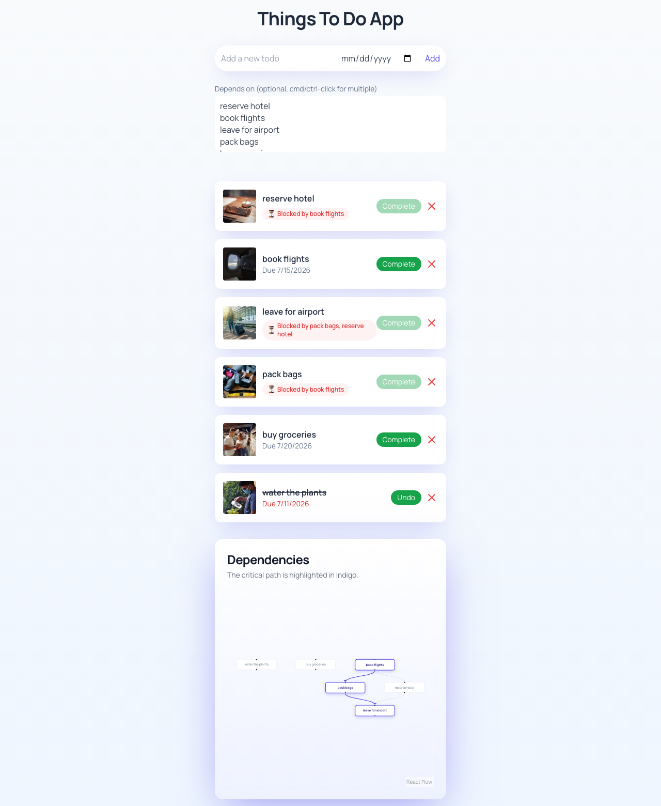

## Soma Capital Technical Assessment

This is a technical assessment as part of the interview process for Soma Capital.

> [!IMPORTANT]  
> You will need a Pexels API key to complete the technical assessment portion of the application. You can sign up for a free API key at https://www.pexels.com/api/  

To begin, clone this repository to your local machine.

## Development

This is a [NextJS](https://nextjs.org) app, with a SQLite based backend, intended to be run with the LTS version of Node.

To run the development server:

```bash
npm i
npx prisma migrate dev
npm run dev
```

## Task:

Modify the code to add support for due dates, image previews, and task dependencies.

### Part 1: Due Dates 

When a new task is created, users should be able to set a due date.

When showing the task list is shown, it must display the due date, and if the date is past the current time, the due date should be in red.

### Part 2: Image Generation 

When a todo is created, search for and display a relevant image to visualize the task to be done. 

To do this, make a request to the [Pexels API](https://www.pexels.com/api/) using the task description as a search query. Display the returned image to the user within the appropriate todo item. While the image is being loaded, indicate a loading state.

You will need to sign up for a free Pexels API key to make the fetch request. 

### Part 3: Task Dependencies

Implement a task dependency system that allows tasks to depend on other tasks. The system must:

1. Allow tasks to have multiple dependencies
2. Prevent circular dependencies
3. Show the critical path
4. Calculate the earliest possible start date for each task based on its dependencies
5. Visualize the dependency graph

## Solution



### Schema

`Todo` gains `dueDate` (optional), `imageUrl` (optional, cached Pexels result), and `completed` (defaults to false).

Dependencies live in a `TodoDependency` join table rather than a self-referential list on `Todo`. Dependencies are many-to-many (a task can depend on several tasks and be depended on by several others), so each edge gets its own row, and `onDelete: Cascade` on both foreign keys means deleting a task cleans up every edge touching it with no application code. A `@@unique([dependentId, dependsOnId])` constraint blocks duplicate edges at the database level.

### Cycle Prevention

Before an edge is written, `wouldCreateCycle` (`lib/scheduling.ts`) runs a DFS from the proposed dependency and rejects the edge if the dependent is already reachable, so a cycle can never enter the database. Checking at write time beats post-hoc validation: the graph stays valid at every moment, so downstream reads (critical path, start dates) can never observe a cycle, and the user gets the error on the action that caused it.

One honest caveat: the UI can't construct a cycle at all, by design. Dependencies are only set at creation and always point at already-existing tasks, so every edge points backward in time. The API-level check is defense-in-depth, not dead code: it protects the endpoint against direct calls (below) and against a future "edit dependencies after creation" feature, where cycles become reachable.

```
--- A depends on B ---
POST /api/todos/15/dependencies {"dependsOnId":16}
HTTP/1.1 201 Created
{"id":11,"dependentId":15,"dependsOnId":16}

--- B depends on A (cycle) ---
POST /api/todos/16/dependencies {"dependsOnId":15}
HTTP/1.1 400 Bad Request
{"error":"circular dependency"}
```

### Images

`fetchTaskImage` (`lib/pexels.ts`) runs server-side, so the Pexels key never reaches the client. The first search result is stored on the todo row (`imageUrl`) at creation time and never refetched. Every failure mode (missing key, timeout, non-200, empty results) resolves to `null`; a todo without an image is fine, a crashed create is not.

Due dates and image lookup are wired into `POST /api/todos`: the handler accepts an optional `dueDate` and fetches the Pexels image before insert, guarded by the 5s timeout so a slow Pexels can only delay creation, never hang it.

In the UI, each card shows its due date (red when past due, compared as Date objects and rendered in UTC so the stored date isn't shifted by timezone) and its image, with a pulse skeleton until the image's `onLoad` fires.

### Scheduling

`computeSchedule` (`lib/scheduling.ts`) is a forward-pass CPM: Kahn's topological sort, then each task's earliest start is the max finish time of its dependencies. The critical path is recovered by tracking, per task, which dependency produced that max and walking back from the latest-finishing task. The backward pass (late start, float) is left out on purpose; nothing in the UI consumes slack, so computing it would be dead code.

### Visualization

React Flow renders the graph and dagre computes the top-to-bottom layout; that pairing is the standard choice for hierarchical dependency graphs (React Flow ships no layout engine by design and its own docs point to dagre for DAGs). Critical-path nodes and edges are highlighted in indigo. Nodes reuse the list's completion vocabulary (checkmark prefix, muted styling) so the graph and the list read as one system. Both urgency signals, overdue red and critical-path indigo, only apply while a task is incomplete; a finished task has nothing urgent left about it.

The graph card and the "Blocked by" badge take their visual direction from Asana's dependency UX: soft white cards, one ambient glow, a single accent color, and an always-visible blocked-state indicator rather than a hover-only hint. Adapted, not copied; credited here rather than passed off as invention.

### Product decision

Completion is blocked while any dependency is open (finish-to-start, the same default Asana uses): if B depends on A, "done" for B is meaningless while A is unfinished, so the Complete button disables with a native tooltip naming the blockers, and the PATCH handler enforces the same rule server-side since the UI is a courtesy, not a trust boundary.

The list is sorted by actionability: unblocked tasks first, then blocked, then completed. A flat list with badges tells you what's blocked; the sort tells you what to do next.

### Deliberate scope

Two calls made on purpose, same category as the cycle-check note above: implemented and verified, not displayed, for a stated reason.

Earliest start dates are calculated but not shown in the UI. Due dates already answer "when is this due"; a second computed date sitting next to that field would answer the same kind of question a second way. What the dependency system adds that due dates and checkboxes can't is an answer to "what can I act on right now, and what is it waiting on", and that's the question the completion guard, the "Blocked by" indicator, the actionability sort, and the highlighted critical path all serve. An earliest-start date is a projection; it doesn't change what you do next, so it stays out of the list. It's still calculated and proven, not skipped: the forward pass in `computeSchedule` computes it, the `'D earliest start'` assertion in `lib/scheduling.ts` verifies it (`schedule.earliestStart.D === 6`), and `GET /api/todos/schedule` serves it. The spec's own wording points the same way, as a footnote: it says "calculate the earliest possible start date" where the critical path and graph requirements say "show" and "visualize".

The UI stays plain on purpose. The rubric weights engineering judgment and correctness far above visual polish, so the time went into the dependency logic and its edge cases (cycle detection, multi-dependency blocking, completion-aware styling) instead.

### API

- `POST /api/todos/[id]/dependencies` with `{ dependsOnId }`: makes task `[id]` depend on `dependsOnId`. Rejects circular dependencies and duplicate edges with 400.
- `GET /api/todos/schedule`: earliest start (in days) per task plus the critical path, from `computeSchedule` over the full graph. Every task uses `durationDays = 1`; no duration field was requested, so the default is explicit rather than invented schema.

## Submission:

1. Add a new "Solution" section to this README with a description and screenshot or recording of your solution. 
2. Push your changes to a public GitHub repository.
3. Submit a link to your repository in the application form.

Thanks for your time and effort. We'll be in touch soon!
